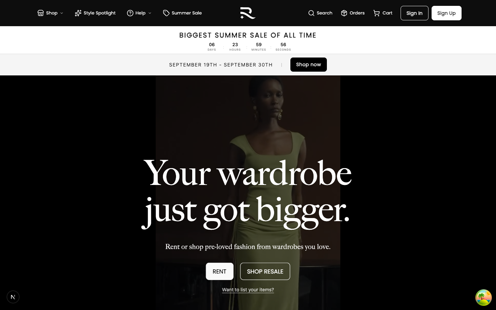
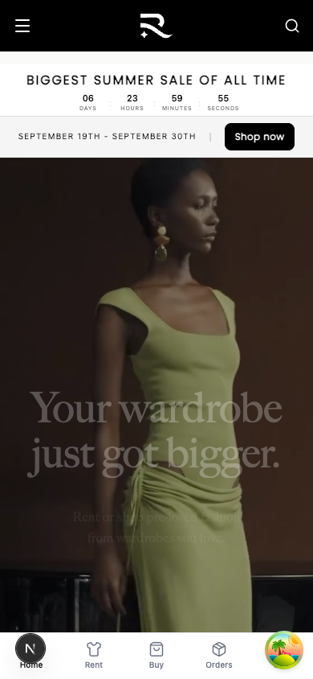
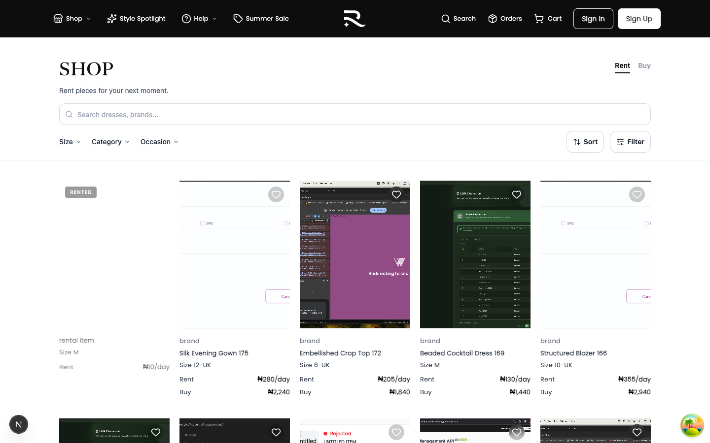
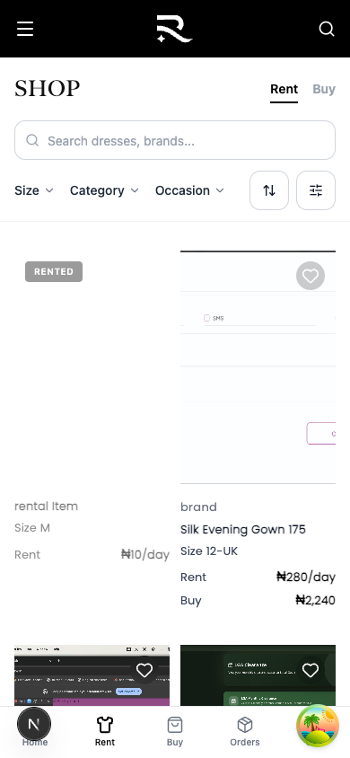
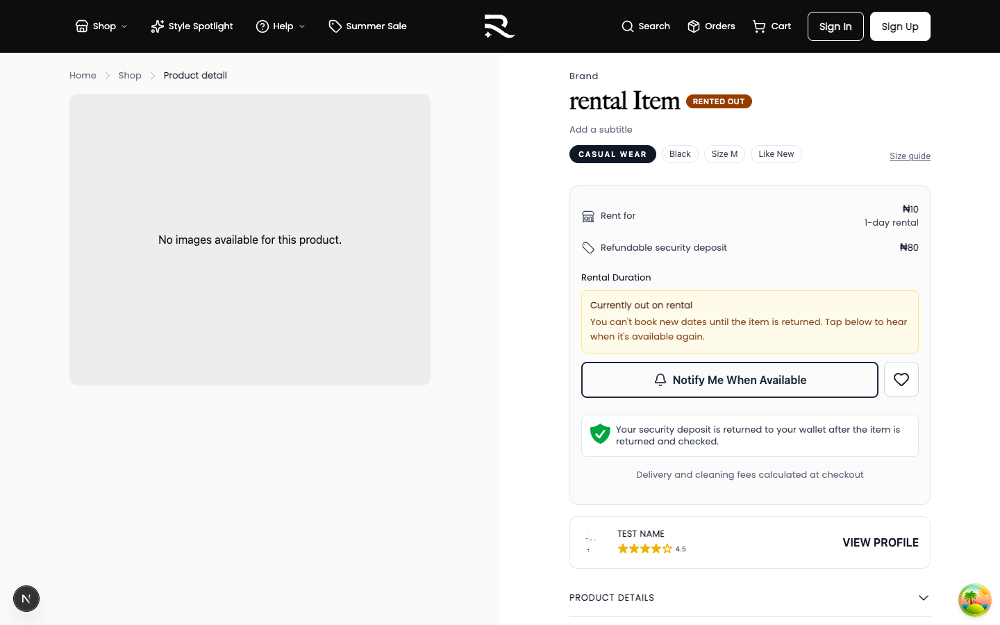
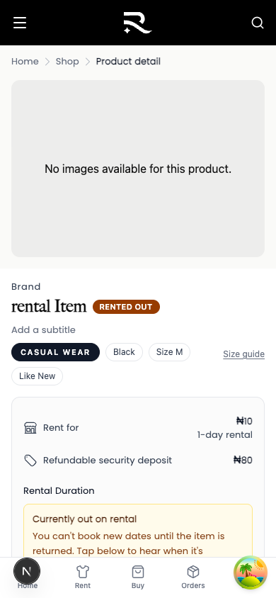
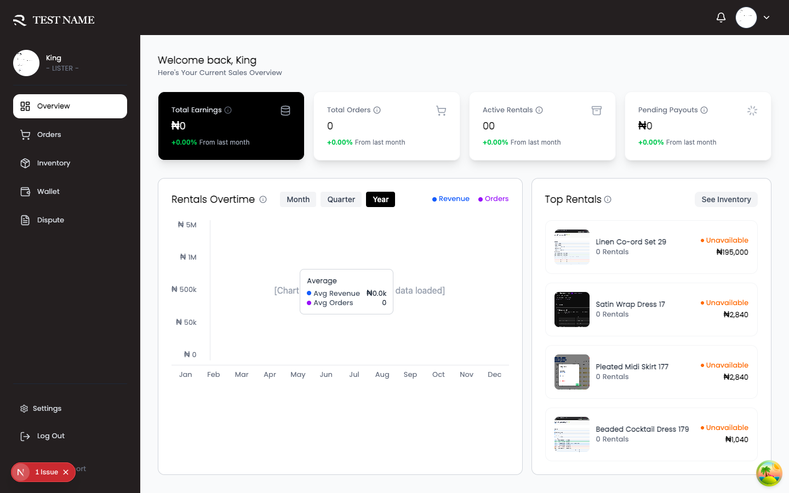
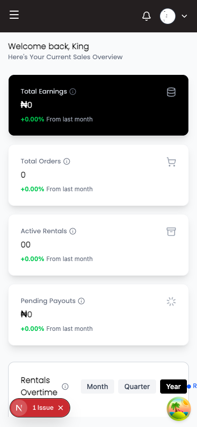
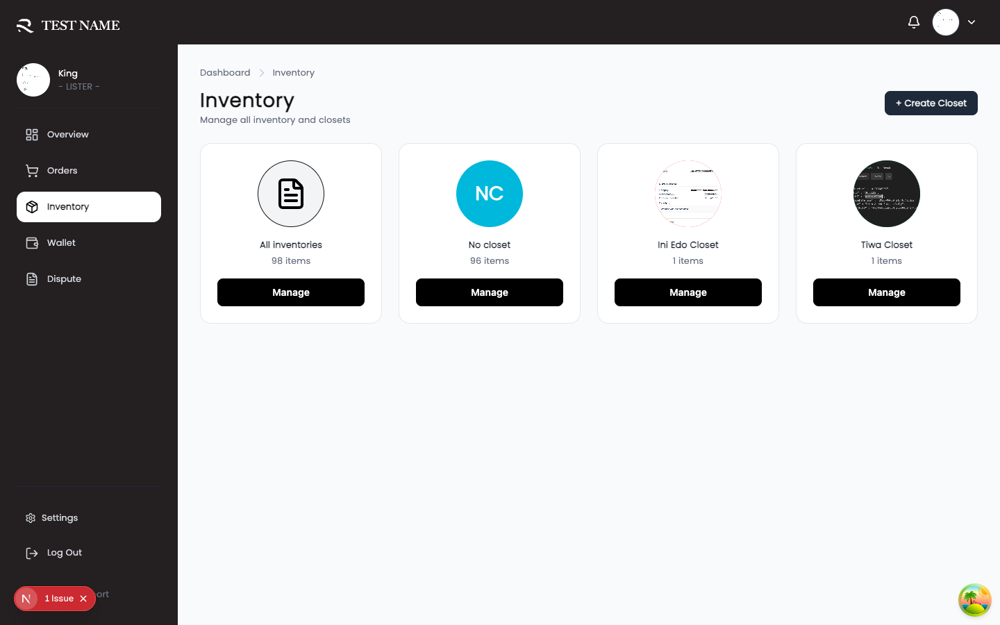
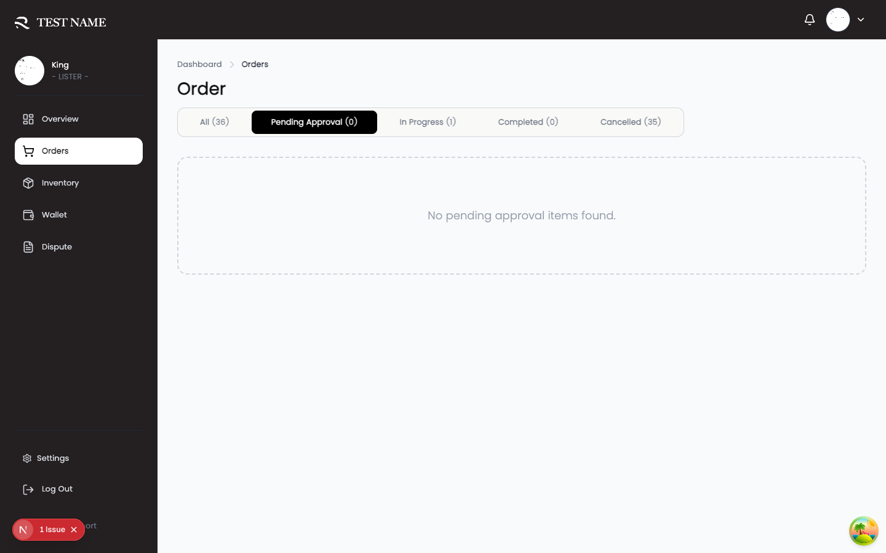

# Relisted Core Flows Guide

A plain-language walkthrough of how renters and listers move through Relisted, from browsing to a finished rental.

Use this when onboarding someone new, writing support replies, or checking that a feature still matches what users see in the app.

**Site:** [https://relistedlabels.com](https://relistedlabels.com)

---

## Getting around the site

Relisted has a public shopping area and two signed-in areas: one for renters and one for listers. You can switch between renter and lister mode from your account menu once you have both profiles set up.

### Main navigation

| Area | Link | What you do there |
|------|------|-------------------|
| Home | [relistedlabels.com](https://relistedlabels.com/) | Browse featured pieces, promotions, and quick links into the shop |
| Shop | [relistedlabels.com/shop](https://relistedlabels.com/shop) | Search and filter rent or buy listings |
| Sign in | [relistedlabels.com/auth/sign-in](https://relistedlabels.com/auth/sign-in) | Log into an existing account |
| Create account | [relistedlabels.com/auth/create-account](https://relistedlabels.com/auth/create-account) | Register as a renter or lister |
| Renter orders | [relistedlabels.com/renters/orders](https://relistedlabels.com/renters/orders) | Track rentals, confirm delivery, start returns |
| Renter wallet | [relistedlabels.com/renters/wallet](https://relistedlabels.com/renters/wallet) | Top up balance and view transactions |
| Lister dashboard | [relistedlabels.com/listers/dashboard](https://relistedlabels.com/listers/dashboard) | Overview of earnings and recent activity |
| Lister orders | [relistedlabels.com/listers/orders](https://relistedlabels.com/listers/orders) | Approve availability requests and manage rentals |
| Lister inventory | [relistedlabels.com/listers/inventory](https://relistedlabels.com/listers/inventory) | Create and manage listings |

On mobile, renters get a bottom tab bar with Home, Shop, Account, Orders, and Wallet.

### Home and shop entry points

From the [home page](https://relistedlabels.com/) you can:

- Tap **RENT** to open the [rental shop](https://relistedlabels.com/shop?listingType=RENTAL,RENT_OR_RESALE)
- Tap **SHOP RESALE** to browse [items for sale](https://relistedlabels.com/shop?listingType=RESALE,RENT_OR_RESALE)
- Follow a promotion banner or featured sale into a filtered shop view
- Open [**New In**](https://relistedlabels.com/shop?title=New+In&description=Latest+arrivals&listingType=RENTAL,RENT_OR_RESALE,RESALE&sort=newest) for the latest arrivals

The [shop page](https://relistedlabels.com/shop) has **Rent** and **Buy** tabs at the top. Use filters for category, brand, size, color, price, and more. Sort by newest, popularity, or price.







---

## Renter flow

This is the full journey from finding a piece to getting your deposit back after a return.

### 1. Find something you like

Browse from the [home page](https://relistedlabels.com/) or go straight to the [shop](https://relistedlabels.com/shop). Tap any product card to open its detail page.

On the product page you will see photos, the daily rental price, rental duration options, and the lister's profile. If the item is already out on rental, you can join a notify list instead of requesting dates.




### 2. Check availability

Tap **Check Availability** on the product page. A panel opens titled **SELECT YOUR DATES**.

Pick:

- Your rental period and duration
- A delivery time window
- A return pickup time window

The lister needs both windows before they can confirm your request.

Tap **Check availability**. If you are not signed in, a short form asks for your name, email, and WhatsApp number so we can notify you when the lister responds. No account is required for this step.

While we wait, you land on a status page:

- **We're checking availability** while the request is being processed
- **Still waiting on the lister** once it reaches them
- **It's available!** when they approve
- **Not available** if they decline or the dates have passed

Approved items move into your cart. They stay reserved for a limited time, so checkout before the timer runs out.

### 3. Go to cart

Open [**Your Cart**](https://relistedlabels.com/shop/cart).

Only lister-approved items appear here. If nothing is ready yet, the page explains that items show up after a lister confirms availability.

The order summary shows rental fees, any security deposit, and delivery. Tap **Proceed to Checkout** when you are ready.

> **Screenshot placeholder:** cart page with an approved item and reservation timer  
> `guide-screenshots/cart-desktop.png`

### 4. Checkout

Checkout at [relistedlabels.com/shop/cart/checkout](https://relistedlabels.com/shop/cart/checkout) has two steps: **Delivery** and **Payment**.

**Step 1: Delivery and return**

- Confirm or add your delivery address and phone number
- Choose your delivery method and delivery window
- Set your return pickup address and return pickup window

These windows are what the carrier uses on delivery day and return day. Orders placed after 11:00am may be delivered the next day.

Tap **Continue to payment**.

**Step 2: Payment**

Review the full breakdown: rental, deposit, delivery, and total.

Payment comes from your Relisted wallet. If your balance is short, tap **Fund Wallet** and add the difference before you pay.

Tap **Complete Order** to place the order. On success you see **Order Successful!** and can go to **View My Orders** or **Continue Shopping**.

> **Screenshot placeholder:** checkout payment step showing wallet balance and Complete Order  
> `guide-screenshots/checkout-desktop.png`

### 5. Fund your wallet

First-time users must verify their identity before they can top up.

Go to the [renter wallet](https://relistedlabels.com/renters/wallet) or use the **Fund Wallet** panel during checkout.

1. Upload a valid ID photo and complete verification
2. Wait for approval, or tap **Refresh status** if it is still under review
3. Tap **Get transfer account** to receive your personal bank transfer details
4. Send money from your bank. Once it lands, your **Available balance** updates

You need enough in the wallet to cover the rental, deposit, and delivery fees at checkout.

> **Screenshot placeholder:** wallet page with transfer account details  
> `guide-screenshots/wallet-desktop.png`

### 6. Delivery day

Track the order under [**My Orders**](https://relistedlabels.com/renters/orders).

When the carrier marks your package as delivered, a banner appears: **Confirm your rental delivery**. You have a short window to:

- Tap **I received this item** if everything looks good
- Tap **Report an issue** if something is wrong

If you do nothing within that window, the rental confirms automatically and your rental period starts.

### 7. Start a return

When your rental is due back, open the order and tap **Start return** or **Start Return Process**.

You must submit a return request before we can book the return pickup. This creates a record of the item's condition in case of a dispute later.

The return flow has a few quick steps:

1. **Confirm you are ready** and review the pickup location and window
2. **Upload photos** of the item and note its condition: Good, Fair, or Poor
3. **Submit** the request

Once submitted, the return pickup is booked for the window you chose. Have the item packed and ready at the pickup address during that time.

> **Screenshot placeholder:** return request modal with photo upload  
> `guide-screenshots/return-request-desktop.png`

### 8. Hand over to the rider

On return day, meet the rider at your pickup location during your selected window. They collect the item and take it back to the lister.

You will get reminders before pickup so you are not caught off guard.

### 9. Rental complete

After the carrier delivers the return to the lister, they inspect the item and confirm receipt in their dashboard.

They have **24 hours** to confirm. If they do not respond in time, the rental completes automatically and your security deposit is released back to your wallet.

You can follow progress from [**My Orders**](https://relistedlabels.com/renters/orders) until the status shows **Completed**.

---

## Lister flow

This covers joining as a lister, listing items, handling requests, and closing out returns.

### 1. Join and set up your profile

Go to [Create account](https://relistedlabels.com/auth/create-account) and choose **Lister**, or upgrade from a renter account via **List Your Wardrobe** on the [home page](https://relistedlabels.com/).

**Create your account**

- Full name, email, password, and terms acceptance
- Verify your email, then [sign in](https://relistedlabels.com/auth/sign-in)

**Complete your profile** at [relistedlabels.com/auth/profile-setup](https://relistedlabels.com/auth/profile-setup)

Step 1, **Personal Information**: phone number, address, city, and state.

Step 2, **Business Profile**: username or brand name, plus optional business details.

After setup you may see a short [onboarding tour](https://relistedlabels.com/onboarding/lister). You can skip it and go straight to the dashboard.




### 2. Lister dashboard

Your home base is the [lister dashboard](https://relistedlabels.com/listers/dashboard).

The sidebar gives you:

| Menu item | Link | Purpose |
|-----------|------|---------|
| Overview | [relistedlabels.com/listers/dashboard](https://relistedlabels.com/listers/dashboard) | Stats, charts, recent rentals |
| Orders | [relistedlabels.com/listers/orders](https://relistedlabels.com/listers/orders) | Availability requests and active rentals |
| Inventory | [relistedlabels.com/listers/inventory](https://relistedlabels.com/listers/inventory) | Your listings |
| Wallet | [relistedlabels.com/listers/wallet](https://relistedlabels.com/listers/wallet) | Earnings and withdrawals |
| Dispute | [relistedlabels.com/listers/dispute](https://relistedlabels.com/listers/dispute) | Open disputes |
| Settings | [relistedlabels.com/listers/settings](https://relistedlabels.com/listers/settings) | Profile, business info, verifications |

The notification bell in the top bar links to [relistedlabels.com/listers/notifications](https://relistedlabels.com/listers/notifications).

On first visit you may be prompted to add a profile photo and create your first listing.

### 3. Create a listing

Go to [**Inventory**](https://relistedlabels.com/listers/inventory) and tap **Add New Item**, or open the [new item form](https://relistedlabels.com/listers/inventory/product-upload) directly.

Fill in:

1. **Sale type**: Rent, Resale, or Rent & Resale
2. **Photos**: at least two images
3. **Basic info**: title, description, brand, size, category, tags
4. **Pricing**: daily rental rate, and resale price if applicable

Tap **Post Item**. New listings may need admin approval before they appear on the shop.

You must complete account verification before you can publish. If prompted, go to [**Settings → Verifications**](https://relistedlabels.com/listers/settings?tab=verifications) and submit your ID and BVN.



### 4. Approve availability requests

When a renter checks availability on one of your items, it appears in [**Orders**](https://relistedlabels.com/listers/orders) as a **Pre-checkout request**.



Open the request to see:

- The renter's chosen dates and delivery/return windows
- A countdown for how long you have to respond

Tap **Approve Order** if you can fulfil the booking, or **Reject Order** with a reason if you cannot.

After approval, the renter sees the item in their cart and can checkout. You will see **Waiting for renter to make payment** until they pay.

You can also respond from email links, which take you to a confirmation page and then into the dashboard.

### 5. Fulfil the rental

Once the renter pays, the order moves through processing, dispatch, and delivery. Track it from the same [**Orders**](https://relistedlabels.com/listers/orders) page under **In Progress**.

You do not need to book delivery yourself. The renter's chosen windows drive scheduling on our side.

### 6. Confirm the return

When the renter submits a return request and the carrier delivers the item back to you, open the order detail page.

Look for **Inspect returned item**. Tap **Inspect Returned Item** to open the inspection modal.

Compare the physical item against the photos the renter uploaded when they started the return. Then choose:

- **Good** or **Fair**: confirm receipt and release funds
- **Poor**: report damage and open a dispute

Tap **Confirm Receipt & Release Funds** to finish.

If you do not confirm within **24 hours**, the rental completes automatically.

> **Screenshot placeholder:** return inspection modal on lister order detail  
> `guide-screenshots/lister-return-inspect-desktop.png`

### 7. Get paid

Rental earnings land in your [lister wallet](https://relistedlabels.com/listers/wallet). From there you can view your balance, see transaction history, and **Withdraw** to a linked bank account.

Set up your bank details under wallet or [settings](https://relistedlabels.com/listers/settings) before your first withdrawal.

---

## Quick reference: renter happy path

1. [Home](https://relistedlabels.com/) or [Shop](https://relistedlabels.com/shop)
2. Product detail
3. Check Availability: pick dates and delivery/return windows
4. Wait for lister approval
5. [Cart](https://relistedlabels.com/shop/cart)
6. [Checkout](https://relistedlabels.com/shop/cart/checkout): delivery details, then payment from wallet
7. Order placed
8. Confirm delivery when item arrives
9. Start return when rental is due
10. Upload photos and book return pickup
11. Hand item to rider
12. Lister confirms return, or auto-completes after 24 hours
13. Deposit released to [wallet](https://relistedlabels.com/renters/wallet)

## Quick reference: lister happy path

1. [Create account](https://relistedlabels.com/auth/create-account) as Lister
2. [Complete profile](https://relistedlabels.com/auth/profile-setup)
3. [Lister dashboard](https://relistedlabels.com/listers/dashboard)
4. Add listing in [Inventory](https://relistedlabels.com/listers/inventory)
5. Approve availability request in [Orders](https://relistedlabels.com/listers/orders)
6. Wait for renter payment
7. Item goes out on rental
8. Inspect returned item when it comes back
9. Confirm receipt
10. Funds released to [lister wallet](https://relistedlabels.com/listers/wallet)

---

## Screenshots included in this guide

| File | Shows |
|------|-------|
| `guide-screenshots/home-desktop.png` | Home page, desktop |
| `guide-screenshots/home-mobile.png` | Home page, mobile |
| `guide-screenshots/shop-desktop.png` | Shop browse, desktop |
| `guide-screenshots/shop-mobile.png` | Shop browse, mobile |
| `guide-screenshots/product-desktop.png` | Product detail, desktop |
| `guide-screenshots/product-mobile.png` | Product detail, mobile |
| `guide-screenshots/lister-dashboard-desktop.png` | Lister dashboard, desktop |
| `guide-screenshots/lister-dashboard-mobile.png` | Lister dashboard, mobile |
| `guide-screenshots/lister-orders-desktop.png` | Lister orders list |
| `guide-screenshots/lister-inventory-desktop.png` | Lister inventory |

### Screenshots still to add

Drop these into `guide-screenshots/` when you capture them:

- `cart-desktop.png` — approved item in cart with reservation timer
- `checkout-desktop.png` — checkout payment step with wallet block
- `wallet-desktop.png` — fund wallet with transfer account
- `return-request-desktop.png` — renter return modal with photo upload
- `lister-return-inspect-desktop.png` — lister return inspection modal

To regenerate the existing screenshots locally, start the frontend and backend, then run:

```bash
cd RELISTED-frontend1
bun run e2e e2e/capture-guide-screenshots.spec.ts
```

---

*Last updated: September 2026*
